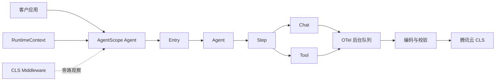

# AgentScope Java CLS Observability SDK

[](https://github.com/Tinker-LGD2026/agentscope-java-cls-observability/actions/workflows/ci.yml)
[](https://github.com/Tinker-LGD2026/agentscope-java-cls-observability/actions/workflows/codeql.yml)
[](docs/compatibility.md)
[](LICENSE)

为 AgentScope Java 应用接入腾讯云 CLS Agent 可观测。SDK 通过 AgentScope `MiddlewareBase` 旁路采集 Entry、Agent、Step、Chat、Tool 调用链，并在后台批量写入 CLS。

> 本项目是社区项目，不是 AgentScope 或腾讯云官方 SDK。AgentScope、腾讯云及相关商标归各自权利人所有。

## 目录

- [它能给你什么](#它能给你什么)
- [10 分钟快速开始](#10-分钟快速开始)
- [最小完整接入](#最小完整接入)
- [Session、User、Turn 怎么传](#sessionuserturn-怎么传)
- [工作原理](#工作原理)
- [完整配置](#完整配置)
- [本地、CVM、Docker、TKE](#本地cvmdockertke)
- [安全与隐私](#安全与隐私)
- [性能、故障隔离与限制](#性能故障隔离与限制)
- [兼容性](#兼容性)
- [示例](#示例)
- [排障](#排障)

## 它能给你什么

| 能力 | 说明 |
|---|---|
| 完整调用链 | 展示 Entry → Agent → ReAct Step → Chat / Tool 的父子关系 |
| 多轮会话 | 相同 `sessionId` 聚合到同一 Session，每次顶层调用生成新的 Turn 和 Trace |
| 多 Agent | 父 Agent 与子 Agent 位于同一 Trace，并分别统计耗时和 Token |
| 模型统计 | 模型、Provider、输入/输出/缓存 Token、结束原因和耗时 |
| 工具观测 | 工具名、Call ID、状态、耗时，以及按策略采集的参数和结果 |
| 错误定位 | Tool、模型或 Agent 失败会写 ERROR Span 和安全错误类型 |
| 正文可选 | 普通正文和模型 Reasoning 独立配置；Reasoning 默认关闭，全部有硬上限 |
| 故障隔离 | 遥测失败不替换 Agent 返回值，也不重试客户业务调用 |
| 后台导出 | OTel 队列批量异步写入 CLS，降低请求路径开销 |

## 10 分钟快速开始

### 1. 准备 JDK 17

```bash
java -version
```

必须是 JDK 17 或更高版本。AgentScope Java 2.0 本身要求 JDK 17+；JDK 11 无法编译或运行本项目。

项目自带 Maven Wrapper，不要求全局安装 Maven：

```bash
./mvnw -version
```

### 2. Clone 并安装到本机 Maven 仓库

本阶段尚未发布 Maven Central，请从 GitHub 源码安装：

```bash
git clone https://github.com/Tinker-LGD2026/agentscope-java-cls-observability.git
cd agentscope-java-cls-observability
./mvnw clean install
```

客户项目添加：

```xml
<dependency>
    <groupId>io.github.tinkerlgd2026</groupId>
    <artifactId>agentscope-cls-observability-sdk</artifactId>
    <version>0.3.0-SNAPSHOT</version>
</dependency>

<!-- SDK 将 AgentScope 声明为 provided，宿主应用必须显式提供 -->
<dependency>
    <groupId>io.agentscope</groupId>
    <artifactId>agentscope-core</artifactId>
    <version>2.0.3</version>
    <exclusions>
        <!-- 本 SDK 不使用 AgentScope 的可选 MCP 客户端/服务端栈。 -->
        <exclusion>
            <groupId>io.modelcontextprotocol.sdk</groupId>
            <artifactId>mcp</artifactId>
        </exclusion>
    </exclusions>
</dependency>
```

### 3. 先运行无需云凭据的 Console Demo

```bash
./mvnw -f demo/pom.xml exec:java
```

成功时：

- 标准输出每行是一条 CLS Span JSON；
- 应看到 `entry`、`agent`、`step`、`chat`；
- 标准错误输出本地 Demo 回复和遥测计数；
- 不访问腾讯云和真实模型。

### 4. 在 CLS 创建 Agent 可观测应用

1. 登录腾讯云 CLS 控制台；
2. 进入 **Agent 可观测**；
3. 通过 **应用接入** 创建应用；
4. 复制应用关联的 **Trace 日志主题 ID**；
5. 记住所选地域；
6. 准备具备最小 CLS 写入权限的 CAM 子账号或临时凭证。

> `CLS_TOPIC_ID` 填 Trace 日志主题 ID，不是应用 ID。Endpoint 地域必须与 Topic 地域一致。

### 5. 配置环境变量

公网或本地环境：

```bash
export CLS_TRANSPORT=cloud
export CLS_ENDPOINT='ap-shanghai.cls.tencentcs.com'
export CLS_TOPIC_ID='<trace-topic-id>'
export CLS_SECRET_ID='<secret-id>'
export CLS_SECRET_KEY='<secret-key>'
export CLS_SERVICE_NAME='my-agent-service'
export CLS_DEPLOYMENT_ENVIRONMENT='development'
```

腾讯云 CVM/TKE 内网环境优先使用：

```bash
export CLS_ENDPOINT='ap-shanghai.cls.tencentyun.com'
```

临时凭证还需要：

```bash
export CLS_SECRET_TOKEN='<session-token>'
```

不要把凭据写进源码、Dockerfile、镜像层、Git 仓库或公开日志。

### 6. 给 Agent 挂载 Middleware

```java
ClsObservabilityConfig config =
        ClsObservabilityConfig.fromEnvironment(System.getenv());

ClsAgentObservability observability =
        ClsAgentObservability.create(config);

// Cloud Transport 已取得自己的凭据副本，清除配置对象中的副本。
config.destroyCredentials();

ReActAgent agent = ReActAgent.builder()
        .name("assistant")
        .model(model)
        .middleware(observability.middleware())
        .build();
```

### 7. 每次顶层调用传 RuntimeContext

```java
RuntimeContext context = RuntimeContext.builder()
        .sessionId(conversationId)
        .userId(currentUserId)
        .build();

Msg response = agent.call(List.of(message), context).block();
```

- `conversationId` 来自客户会话表或聊天窗口 ID；后端必须先确认该会话属于当前已认证用户，不能直接信任前端任意传入的 ID；
- `currentUserId` 来自登录系统；
- 同一连续对话复用相同 `sessionId`；
- 用户新建对话时生成新的 `sessionId`；
- 子 Agent 和 Tool 不需要重新创建 `RuntimeContext`。

### 8. 刷新并查看 CLS

```java
boolean flushed = observability.flush(Duration.ofSeconds(5));
System.out.println(observability.snapshot());
observability.close();
```

然后在 CLS Agent 可观测的调用链页面选择包含当前请求的时间范围。CLS 建立索引可能存在短暂延迟。

## 最小完整接入

```java
import io.agentscope.core.ReActAgent;
import io.agentscope.core.agent.RuntimeContext;
import io.agentscope.core.message.Msg;
import io.github.tinkerlgd2026.agentscope.cls.ClsAgentObservability;
import io.github.tinkerlgd2026.agentscope.cls.ClsObservabilityConfig;
import java.time.Duration;
import java.util.List;

ClsObservabilityConfig config =
        ClsObservabilityConfig.fromEnvironment(System.getenv());

try (ClsAgentObservability observability = ClsAgentObservability.create(config)) {
    config.destroyCredentials();

    RuntimeContext context = RuntimeContext.builder()
            .sessionId(conversationId)
            .userId(currentUserId)
            .build();

    // ReActAgent 不是线程安全对象：按请求创建，或由业务层保证串行调用。
    try (ReActAgent agent = ReActAgent.builder()
            .name("assistant")
            .model(model)
            .middleware(observability.middleware())
            .build()) {
        Msg response = agent.call(List.of(message), context).block();
        System.out.println(response.getTextContent());
    }

    if (!observability.flush(Duration.ofSeconds(5))) {
        System.err.println("CLS telemetry flush did not complete");
    }
}
```

`ClsAgentObservability` 通常是应用级长生命周期对象。上例为了完整展示关闭流程放在一个代码块里；Web 服务应在应用启动时创建，在应用退出时关闭。

## Session、User、Turn 怎么传

| 数据 | 由谁提供 | 生命周期 | 示例 |
|---|---|---|---|
| `sessionId` | 客户会话系统 | 一段连续对话 | `conversation-20260910-001` |
| `userId` | 客户登录/租户系统 | 稳定用户标识 | `tenant-a:user-10428` |
| `RuntimeContext` | 客户 Agent 调用服务 | 每次顶层调用 | 每个 HTTP 请求创建一个 |
| `turnId` | SDK 默认生成，客户可覆盖 | 一次顶层调用 | `session:t:<uuid>` |
| `traceID` | OpenTelemetry 自动生成 | 一次顶层调用 | 32 位十六进制 ID |

身份字段会按 UTF-8 字节限制：`sessionId`、`userId`、`turnId` 最多 512 bytes，`userName` 最多 256 bytes，`agentType`、`entryType` 最多 128 bytes。超长值会保留有界前缀并追加稳定 SHA-256 短指纹，避免 Span 无界增长，同时维持相同原值的稳定映射。客户仍应优先传短、稳定、非敏感的内部 ID。

两个不同的 `RuntimeContext` 对象，只要 `sessionId` 相同，仍属于同一 Session：

```text
Session conversation-001
├── Turn 1 / Trace A
└── Turn 2 / Trace B
```

最简单的 Web 服务封装：

```java
public Mono<Msg> chat(String sessionId, String userId, Msg message) {
    RuntimeContext context = RuntimeContext.builder()
            .sessionId(sessionId)
            .userId(userId)
            .build();

    ReActAgent requestAgent = createAgent();
    return requestAgent.call(List.of(message), context)
            .doFinally(ignored -> requestAgent.close());
}
```

对象生命周期：

| 对象 | 推荐生命周期 | 注意事项 |
|---|---|---|
| `ClsAgentObservability` | 应用级 | 退出时 `flush()` / `close()` |
| `ReActAgent` | 请求级，或按 Session 串行管理 | 不能被多个并发请求共享 |
| `RuntimeContext` | 每次顶层调用 | 创建成本低 |
| `sessionId` | 业务会话级 | 多轮复用相同值 |
| `userId` | 用户级 | 使用非敏感内部 ID |

高级字段可以放入 `ClsInvocationContext`：

```java
RuntimeContext context = RuntimeContext.builder()
        .sessionId(sessionId)
        .userId(userId)
        .put(
                ClsInvocationContext.class,
                new ClsInvocationContext(
                        displayName,
                        businessRequestId,
                        "customer-service-agent",
                        "web-api"))
        .build();
```

`ClsInvocationContext` 是可选项。没有稳定业务请求 ID 时，将 `turnId` 传 `null`，由 SDK 每轮自动生成。

## 工作原理



典型调用树：

```text
enter_application
└── invoke_agent travel-planner
    ├── react round_1
    │   ├── chat deepseek-chat
    │   └── execute_tool ask_weather_expert
    ├── invoke_agent weather-expert
    │   └── react round_1
    │       ├── chat deepseek-chat
    │       └── execute_tool query_weather
    └── react round_2
        └── chat deepseek-chat
```

SDK 使用独立的 `SdkTracerProvider`，不替换宿主 `GlobalOpenTelemetry`。默认通过私有 Reactor Context 键传播父子关系，不注册进程级 Reactor Hook。

详细说明见 [`docs/architecture.md`](docs/architecture.md)。

## 完整配置

| 环境变量 | 默认值 | 说明 |
|---|---:|---|
| `CLS_TRANSPORT` | 自动判断 | `console` 或 `cloud` |
| `CLS_ENDPOINT` | Cloud 必填 | CLS 地域接入点，不带路径和参数 |
| `CLS_TOPIC_ID` | Cloud 必填 | Agent 可观测应用的 Trace Topic ID |
| `CLS_SECRET_ID` | Cloud 必填 | CAM SecretId |
| `CLS_SECRET_KEY` | Cloud 必填 | CAM SecretKey |
| `CLS_SECRET_TOKEN` | 无 | 临时凭证 Token |
| `CLS_SERVICE_NAME` | `agentscope-java-app` | 服务名，1–128 字符 |
| `CLS_DEPLOYMENT_ENVIRONMENT` | 无 | 如 `production` / `staging` |
| `CLS_CONTENT_CAPTURE` | `off` | 普通正文和工具内容：`off` / `hash` / `truncate` / `full` |
| `CLS_REASONING_CAPTURE` | `off` | 模型推理正文独立策略：`off` / `hash` / `truncate` / `full` |
| `CLS_MAX_CONTENT_BYTES` | `1100000` | 单个正文 Attribute 的字节上限，范围 256–1100000 |
| `CLS_EXPORT_SCHEDULE_DELAY_MS` | `2000` | 批量导出间隔，范围 50–60000 |
| `CLS_MAX_QUEUE_SIZE` | `4096` | 内存队列 Span 数，范围 256–65536 |
| `CLS_REACTOR_CONTEXT_HOOK` | `false` | 是否启用进程级 OTel Reactor Hook |

完整说明见 [`docs/configuration.md`](docs/configuration.md)。

## 本地、CVM、Docker、TKE

这些环境的 Java 接入代码相同，差别主要是配置和密钥如何注入：

| 环境 | Endpoint | 密钥注入 |
|---|---|---|
| 本地开发 | 公网 `*.cls.tencentcs.com` | 当前终端环境变量 |
| CVM/systemd | 优先内网 `*.cls.tencentyun.com` | 权限 `0600` 的 `EnvironmentFile` 或 Secret 服务 |
| Docker | 视网络环境选择 | `docker run --env-file`，不写 Dockerfile |
| TKE/Kubernetes | 优先内网 | Kubernetes Secret + `secretKeyRef` |

模板见 [`deploy/`](deploy/)；详细说明见 [`docs/deployment.md`](docs/deployment.md)。

## 安全与隐私

生产环境建议：

```bash
export CLS_CONTENT_CAPTURE=truncate
export CLS_REASONING_CAPTURE=off
export CLS_REACTOR_CONTEXT_HOOK=false
```

重要边界：

- 普通正文与 Reasoning 策略互不继承；开启普通正文不会自动上传推理内容。
- `CLS_REASONING_CAPTURE=off` 不上传推理原文或稳定 Hash，但仍记录存在性、块数、字节数和时序指标。
- 普通正文 `off` 不上传消息正文和工具参数/结果，但 Chat Span 仍包含稳定、无盐的输入消息 SHA-256；低熵内容可能被字典推断。如果合规要求禁止任何普通内容派生值，需要在接入前评估。
- `hash` 不是加密；它用于关联相同内容。
- `truncate/full` 会上传脱敏后的正文；脱敏只能降低风险，不能保证识别所有业务秘密和个人数据。
- `full` 仍受单字段 1.1 MB 硬上限保护。
- `sessionId`、`userId`、`userName` 和 `host.name` 也属于需要纳入数据治理的标识信息。
- SDK 不采集 cwd、Git 仓库、分支、Remote 或提交信息。
- SDK 不生成不可靠的 `gen_ai.input.messages_delta`。

详见 [`docs/security-and-privacy.md`](docs/security-and-privacy.md) 和 [`SECURITY.md`](SECURITY.md)。

## 性能、故障隔离与限制

- Span 在内存队列中异步批量导出；默认队列 4096，批量上限 256，调度间隔 2 秒。
- 遥测构建、序列化、上传、flush 和 close 失败不会替换 Agent 业务返回值。
- 非法 Span 逐条隔离，不丢弃同批其他合法 Span。
- 队列不是持久队列；进程崩溃、强制终止、队列溢出或 flush 超时可能丢失尾部数据。
- SDK 的 `droppedSpans` 不包含 OTel `BatchSpanProcessor` 内部队列丢弃，因为上游没有逐条回调。
- 本 SDK 不应作为审计日志、财务计费或强一致事件系统。
- 同一个 Agent 不要再注册 AgentScope 内置 `OtelTracingMiddleware` 或旧 `TelemetryTracer`。

## 兼容性

| 组件 | 状态 |
|---|---|
| JDK 17 | 最低版本、已验证 |
| JDK 21 | 已通过本地全量验证；GitHub CI 将持续验证 |
| JDK 11 | 不支持 |
| AgentScope Java 2.0.3 | 已验证 |
| 其他 AgentScope 2.x | 尚未承诺 |
| Maven | Wrapper 提供；推荐 3.9+ |

JDK 17 和 JDK 21 均已完成全量验证。构建使用 `--release 17`，所以在 JDK 21 上构建仍生成 Java 17 字节码。详见 [`docs/compatibility.md`](docs/compatibility.md)。

## 示例

### 离线最小 Demo

```bash
./mvnw -f demo/pom.xml exec:java
```

不需要云凭据或模型密钥。

### 真实多 Agent 旅行 Demo

使用真实 DeepSeek、免密钥 Open-Meteo、两个子 Agent、预算工具和真实 CLS：

```bash
export DEEPSEEK_API_KEY='<model-key>'
export CLS_TRANSPORT=cloud
export CLS_ENDPOINT='ap-shanghai.cls.tencentcs.com'
export CLS_TOPIC_ID='<trace-topic-id>'
export CLS_SECRET_ID='<secret-id>'
export CLS_SECRET_KEY='<secret-key>'
export CLS_CONTENT_CAPTURE=truncate
export CLS_REASONING_CAPTURE=off
export TRAVEL_ENABLE_REASONING=true
export TRAVEL_SESSION_ID='travel-session-001'
export TRAVEL_USER_ID='customer-001'

./mvnw -f demo/pom.xml \
  -Dexec.mainClass=io.github.tinkerlgd2026.agentscope.cls.demo.travel.TravelPlannerApplication \
  exec:java
```

该示例会产生模型调用费用，并访问 DeepSeek、Open-Meteo 和腾讯云 CLS。

## 排障

### CLS 没有数据

1. 确认 `CLS_TRANSPORT=cloud`；
2. 确认 Topic ID 不是应用 ID；
3. 确认 Endpoint 与 Topic 同地域；
4. 确认 CAM 身份具有目标 Topic 写权限；
5. 确认 `RuntimeContext` 同时有 `sessionId` 和 `userId`；
6. 调用 `flush()`；
7. 查看 `observability.snapshot()`；
8. 等待 CLS 索引完成。

### 同一 Session 没有聚合

同一连续对话必须复用相同 `sessionId`。`RuntimeContext` Java 对象可以每次新建。

### 出现重复 Trace

移除重复的 OTel Middleware；同一个 Agent 只保留本 SDK。

### 看不到正文

普通正文和 Reasoning 默认关闭。只排查最终回答时可短期设置：

```bash
export CLS_CONTENT_CAPTURE=truncate
export CLS_REASONING_CAPTURE=off
```

只有明确需要排查模型推理且已获得授权时，才临时设置 `CLS_REASONING_CAPTURE=truncate`。使用前先阅读隐私说明，排障后恢复 `off`。

更多问题见 [`docs/troubleshooting.md`](docs/troubleshooting.md)。

## 贡献、支持与许可证

- 构建和贡献：[`CONTRIBUTING.md`](CONTRIBUTING.md)
- 安全问题：[`SECURITY.md`](SECURITY.md)
- 支持范围：[`SUPPORT.md`](SUPPORT.md)
- 变更记录：[`CHANGELOG.md`](CHANGELOG.md)
- GitHub 仓库与 Release：[`docs/github-setup.md`](docs/github-setup.md)
- 许可证：[Apache License 2.0](LICENSE)
- 第三方依赖声明：[`THIRD-PARTY-NOTICES.md`](THIRD-PARTY-NOTICES.md)
