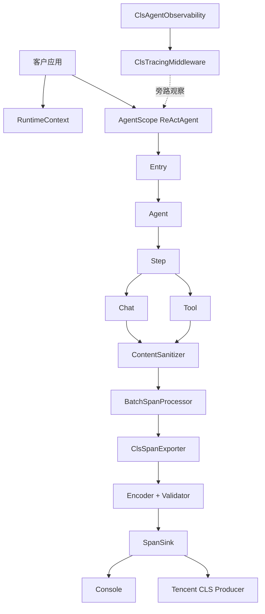
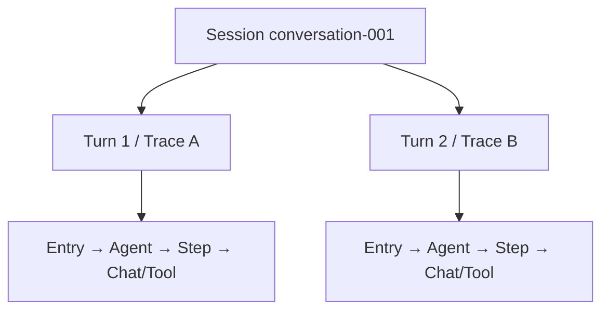
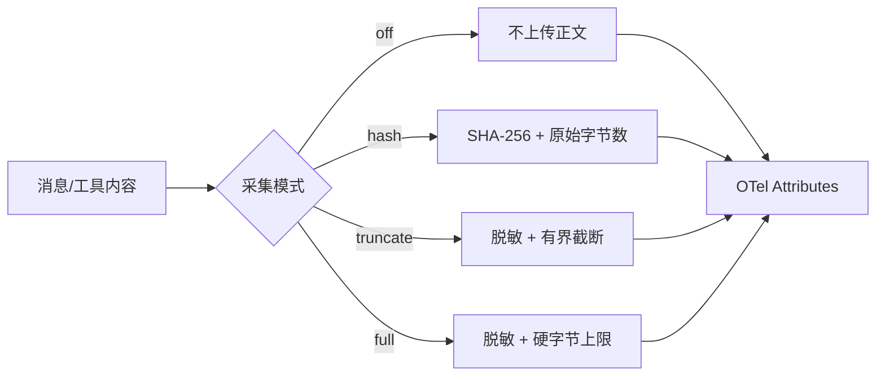

# 架构与数据流

## 目标

SDK 通过 AgentScope `MiddlewareBase` 观察 Agent 生命周期，将事件转换为 CLS Agent Trace，同时保持三个边界：

1. 遥测失败不能替换业务结果；
2. 正文默认不上传且采集量有界；
3. 不接管宿主的 `GlobalOpenTelemetry`，默认不安装进程级 Reactor Hook。

## 系统结构



## 三类上下文

### RuntimeContext

客户在每次顶层 `agent.call()` 时提供的请求资料：

- `sessionId`；
- `userId`；
- 可选 `ClsInvocationContext`。

它回答：“这是谁的哪段业务会话？”

### Reactor Context

跟随异步订阅链传播的私有键值容器。SDK在其中携带：

- 当前 Invocation；
- 当前 Agent；
- 当前 Step；
- 当前 OTel Context。

它回答：“异步执行现在位于哪一层，下一条 Span 应该挂在哪里？”

### InvocationState

SDK 为一次顶层 Agent 调用创建的动态工作档案，保存：

- Session、User、Turn；
- Entry Span；
- Agent Token 汇总；
- ReAct round；
- Tool Call 与 Step 的关联；
- 模型和 Provider 上下文。

它回答：“本轮已经发生了什么？”

`InvocationState` 不是跨轮 Session Store。顶层调用结束后，它随 Reactor 链释放。

## Session、Turn 与 Trace



- Session：连续业务会话，由客户 `sessionId` 决定；
- Turn：一次顶层 Agent 调用；
- Trace：一次顶层调用的完整链路；
- 相同 Session 的多轮调用使用不同 Turn 和 Trace。

## Span 生命周期

### Entry

- 名称固定为 `enter_application`；
- Trace 根节点；
- `service.name` 只写在 Resource；
- 覆盖一次顶层 Agent 调用。

### Agent

- 名称 `invoke_agent <name>`；
- 汇总 Agent Token 和 Tool 次数；
- 子 Agent 继承父调用的 Session/User/Turn/Trace。

### Step

- 名称 `react round_<N>`；
- 覆盖一次 ReAct 推理及随后工具执行；
- Tool 是 Step 的直接子 Span。

### Chat

- 名称 `chat <model>`；
- 记录模型、Provider、Token、finish reason、耗时和按策略采集的消息。

### Tool

- 名称 `execute_tool <name>`；
- 一次 Tool Call 对应一个 Span；
- 记录 Call ID、名称、参数、结果、耗时和错误类型。

## 多 Agent 实测拓扑

AgentScope 2.0.3 原生 `SubAgentTool` 的实际结构：

```text
Entry
└── Parent Agent
    ├── Parent Step
    │   └── Tool ask_child_agent
    └── Child Agent
        └── Child Step
            ├── Child Chat
            └── Child Tool
```

子 Agent 和委派 Tool 都位于同一 Trace，但子 Agent 直接挂在父 Agent 下，而不是挂在 Tool Span 下。它们通过共同的父 Agent、Session、Turn 和 Trace 关联。

## 正文处理



即使 `off`，Chat 仍记录输入消息 Hash。Hash 是内容派生值，不是加密。

## 导出链路

1. Span 完成后进入 OTel `BatchSpanProcessor` 内存队列；
2. 达到批量阈值、调度时间、flush 或 close 时交给 Exporter；
3. Encoder 将 OTel Span 转成 CLS 15 个顶层字段；
4. Validator 逐条校验 ID、时间、Resource 和 GenAI 字段；
5. 非法 Span 单独丢弃，不影响同批合法 Span；
6. Console Sink 写 stdout，Cloud Sink 交给腾讯 CLS Async Producer。

## flush 与 close

`flush(timeout)` 分两层：

1. 排空 OTel Processor 队列；
2. 等待 Sink 中 flush 屏障之前接受的异步请求完成。

`close()`：

1. 停止接受新遥测；
2. 关闭 Provider、Exporter 和 Sink；
3. 最多等待固定关闭预算；
4. 失败只记录，不向业务抛异常。

## 故障隔离

- Span 创建失败：执行原业务 Flux；
- 序列化失败：跳过或降级遥测；
- CLS 失败：后台计数，不重试业务；
- Tool/模型业务失败：原异常语义不变，相关 Span 标记 ERROR；
- 日志限频，避免遥测故障刷爆宿主日志。
