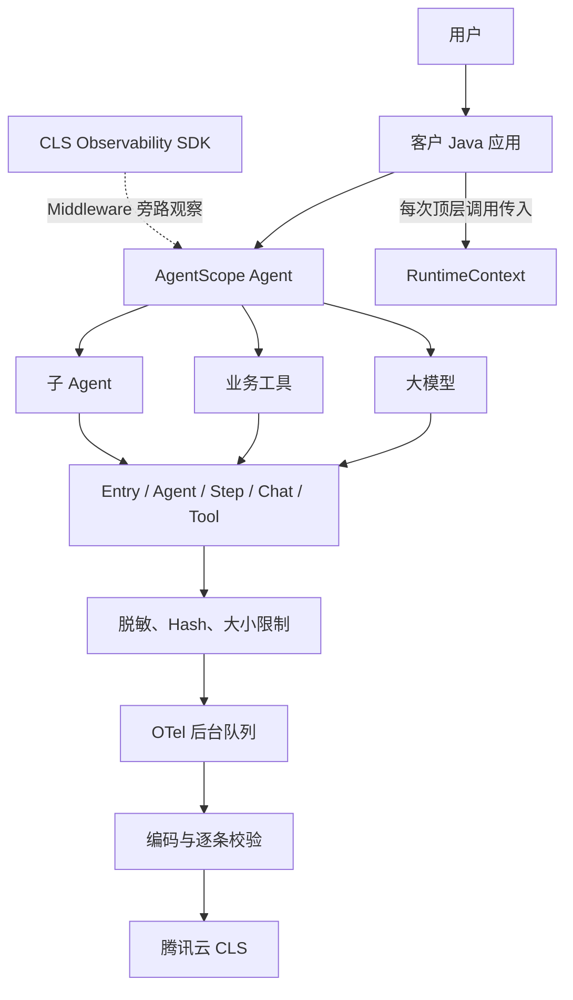
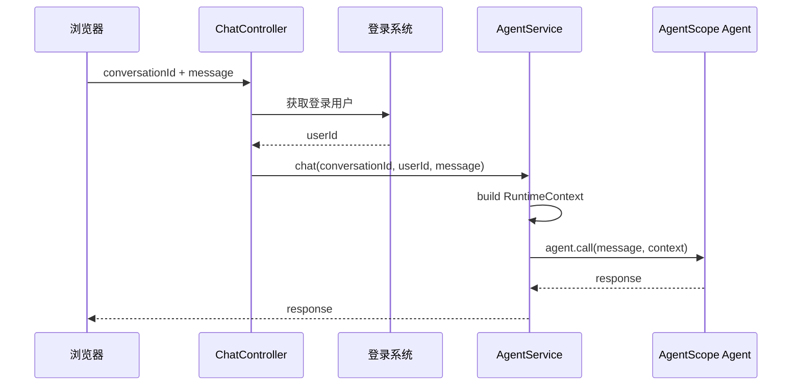
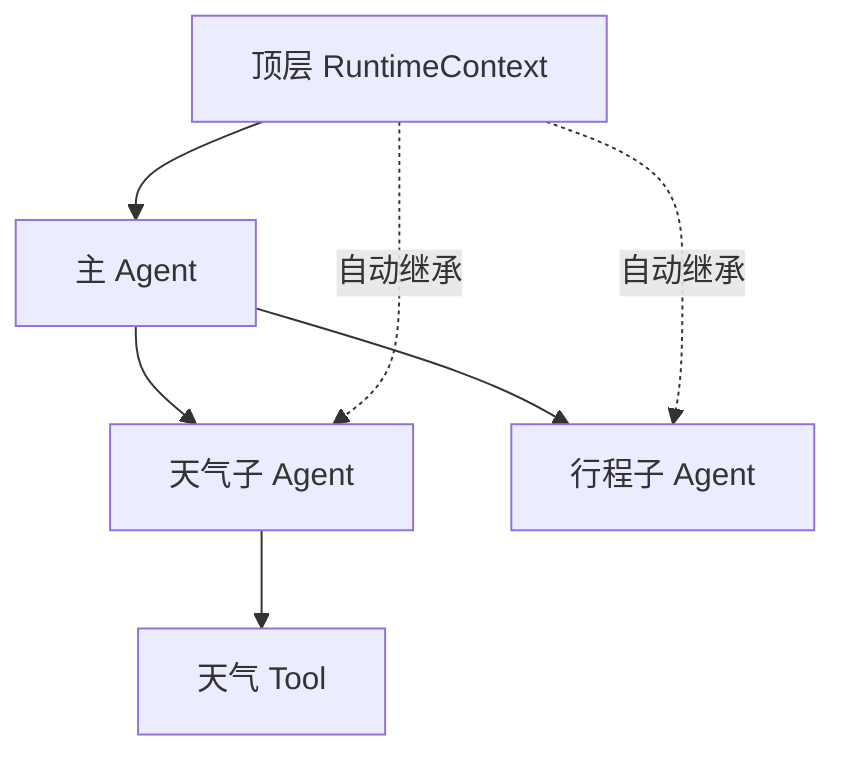
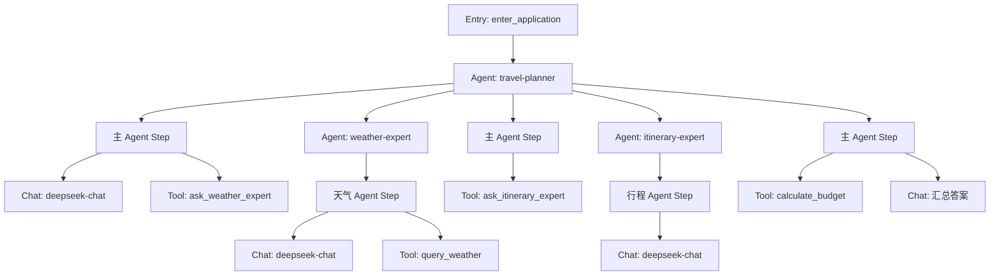

# AgentScope Java CLS SDK 零基础接入指南

本文面向第一次接入本 SDK 的 Java 开发者。目标是先用最少代码跑通，再理解 Session、User、Trace 和多 Agent 的数据关系。

## 1. SDK 是做什么的

SDK 是安装在 Agent 旁边的“黑匣子记录仪”。它不会替 Agent 回答问题，只记录一次调用中的关键步骤：

```text
用户进入应用
→ Agent 开始工作
→ 一轮思考
→ 调用大模型
→ 调用工具或子 Agent
→ 返回结果
```

这些步骤会形成以下 Span：

| Span | 含义 | 示例名称 |
|---|---|---|
| Entry | 一次顶层应用调用 | `enter_application` |
| Agent | 一个 Agent 的执行 | `invoke_agent travel-planner` |
| Step | 一轮 ReAct 思考/行动 | `react round_1` |
| Chat | 一次模型调用 | `chat deepseek-chat` |
| Tool | 一次工具或子 Agent 委派 | `execute_tool query_weather` |

SDK 在后台批量上传，不会在正常情况下等待每条 Span 完成网络请求。

## 2. 整体架构



客户只需要负责三件事：

1. 应用启动时创建一个 `ClsAgentObservability`；
2. 创建 Agent 时挂载 `observability.middleware()`；
3. 每次顶层 `agent.call()` 传入带 `sessionId` 和 `userId` 的 `RuntimeContext`。

子 Agent、模型调用和工具调用不需要客户重复创建 RuntimeContext。

## 3. 运行要求

- JDK 17+
- Maven 3.9+
- AgentScope Java 2.0.3

当前首个公开版本为 `0.1.0`。尚未发布到 Maven Central 时，先在 SDK 源码目录执行：

```bash
./mvnw install -DskipTests
```

然后在客户项目中引用：

```xml
<dependency>
    <groupId>io.github.tinkerlgd2026</groupId>
    <artifactId>agentscope-cls-observability-sdk</artifactId>
    <version>0.1.0</version>
</dependency>
```

客户项目还需要自行提供 AgentScope 运行时，因为 SDK 将 `agentscope-core` 声明为 `provided`：

```xml
<dependency>
    <groupId>io.agentscope</groupId>
    <artifactId>agentscope-core</artifactId>
    <version>2.0.3</version>
    <exclusions>
        <!-- 本示例不使用 AgentScope 的可选 MCP 客户端/服务端栈。 -->
        <exclusion>
            <groupId>io.modelcontextprotocol.sdk</groupId>
            <artifactId>mcp</artifactId>
        </exclusion>
    </exclusions>
</dependency>
```

使用 DeepSeek 等 OpenAI 兼容模型时，再加入对应 AgentScope 模型扩展：

```xml
<dependency>
    <groupId>io.agentscope</groupId>
    <artifactId>agentscope-extensions-model-openai</artifactId>
    <version>2.0.3</version>
</dependency>
```

## 4. 配置腾讯云 CLS

不要把密钥写在 Java 源码、配置仓库或启动脚本中。推荐通过部署平台的 Secret 管理能力注入环境变量。

```bash
export CLS_TRANSPORT=cloud
export CLS_ENDPOINT='<region>.cls.tencentcs.com'
export CLS_TOPIC_ID='<trace-topic-id>'
export CLS_SECRET_ID='<secret-id>'
export CLS_SECRET_KEY='<secret-key>'
export CLS_SERVICE_NAME='my-travel-agent'
```

临时凭证还需要：

```bash
export CLS_SECRET_TOKEN='<session-token>'
```

要求：

- Endpoint 与 Topic 位于同一地域；
- SDK 只接受 HTTPS 腾讯云 CLS 域名；
- 使用最小权限、可轮换的 CAM 身份；
- 不要在日志中打印 `ClsObservabilityConfig` 之外的原始环境变量。

不设置 Cloud 参数时默认进入 Console 模式，每行输出一条 CLS 格式 JSON，适合本地调试。

## 5. 最小接入：只需要四步

### 第一步：应用启动时创建 SDK

```java
ClsObservabilityConfig config =
        ClsObservabilityConfig.fromEnvironment(System.getenv());

ClsAgentObservability observability =
        ClsAgentObservability.create(config);

config.destroyCredentials();
```

`destroyCredentials()` 会清零配置对象持有的 CLS 凭据副本。调用后不要再使用这个配置对象创建第二个 Cloud Transport。

`ClsAgentObservability` 应当是应用级长生命周期对象，不要每次 HTTP 请求都重新创建。模型客户端也可以在确认线程安全并能正常关闭的前提下复用。`ReActAgent` 不是线程安全对象，不要让多个并发请求共享同一个实例。

### 第二步：创建 Agent 时挂载 Middleware

```java
ReActAgent agent =
        ReActAgent.builder()
                .name("travel-planner")
                .model(model)
                .middleware(observability.middleware())
                .build();
```

同一个 Agent 不要再同时挂载 AgentScope 内置 `OtelTracingMiddleware` 或旧 `TelemetryTracer`，否则可能生成重复 Trace。

### 第三步：每次顶层调用创建 RuntimeContext

最小写法：

```java
RuntimeContext context =
        RuntimeContext.builder()
                .sessionId(sessionId)
                .userId(userId)
                .build();
```

然后调用：

```java
Msg response = agent.call(List.of(message), context).block();
```

### 第四步：应用退出前刷新和关闭

```java
observability.flush(Duration.ofSeconds(5));
observability.close();
```

推荐使用 try-with-resources：

```java
try (ClsAgentObservability observability =
        ClsAgentObservability.create(config)) {
    // 创建并调用 Agent
    observability.flush(Duration.ofSeconds(5));
}
```

## 6. RuntimeContext 到底怎么传

### 6.1 每次都要传吗

每次顶层 `agent.call()` 都要传一个 `RuntimeContext`。

但是客户不需要在 Controller、Service、Agent、Tool 中到处手工组装。推荐只在统一的 Agent 调用服务中创建一次：

```java
public Mono<Msg> chat(
        String sessionId,
        String userId,
        Msg message) {
    RuntimeContext context =
            RuntimeContext.builder()
                    .sessionId(sessionId)
                    .userId(userId)
                    .build();

    ReActAgent requestAgent = createAgent();
    return requestAgent.call(List.of(message), context)
            .doFinally(ignored -> requestAgent.close());
}
```

调用关系：



### 6.2 `sessionId` 从哪里来

`sessionId` 应使用客户业务系统已有的会话 ID，例如数据库中的 `conversationId`：

```text
conversation-20260910-001
```

规则：

- 用户继续当前对话：继续传相同 `sessionId`；
- 用户点击“新建对话”：业务系统生成新 `sessionId`；
- 页面刷新后恢复历史对话：从数据库读取原 `sessionId`；
- 不要每条消息都生成新 `sessionId`，否则 CLS 无法聚合多轮会话。

### 6.3 `userId` 从哪里来

`userId` 应来自客户登录或租户系统：

```text
tenant-a:user-10428
```

建议使用稳定、不可直接识别个人身份的内部 ID。不要直接传手机号、身份证、邮箱或真实姓名。

后端接收前端传来的 `conversationId` 后，必须查询会话表并确认它属于当前登录用户，再作为 `sessionId` 传给 Agent。否则攻击者可以构造别人的会话 ID，污染其他用户在 CLS 中的 Session 聚合。

SDK 会限制身份字段的 UTF-8 大小：`sessionId`、`userId`、`turnId` 最多 512 bytes，`userName` 最多 256 bytes，`agentType`、`entryType` 最多 128 bytes。超长值会保留有界前缀并追加稳定短指纹；正式系统仍应使用短的数据库主键或 UUID。

### 6.4 RuntimeContext 对象需要复用吗

不需要复用 Java 对象。

下面两次调用虽然创建了两个对象，但仍属于同一个 Session：

```java
RuntimeContext first =
        RuntimeContext.builder()
                .sessionId("conversation-001")
                .userId("user-001")
                .build();

RuntimeContext second =
        RuntimeContext.builder()
                .sessionId("conversation-001")
                .userId("user-001")
                .build();
```

SDK 看的是字段值，不是对象地址。

结果为：

```text
相同 sessionId
不同 turnId
不同 traceID
```

### 6.5 子 Agent 还要再创建吗

不需要。

只在调用最外层主 Agent 时传一次：

```java
mainAgent.call(List.of(message), context);
```

AgentScope 原生 `SubAgentTool` 会把父级 RuntimeContext 传给子 Agent。模型和普通 Tool 也不需要客户重新创建上下文。



## 7. 可选高级身份字段

只传 `sessionId` 和 `userId` 已经可以正常使用。需要额外展示或关联客户请求时，可加入 `ClsInvocationContext`：

```java
RuntimeContext context =
        RuntimeContext.builder()
                .sessionId(sessionId)
                .userId(userId)
                .put(
                        ClsInvocationContext.class,
                        new ClsInvocationContext(
                                userName,
                                businessRequestId,
                                "travel-planner",
                                "web-api"))
                .build();
```

| 字段 | 是否必需 | 含义 |
|---|---:|---|
| `userName` | 否 | 展示名称；不建议使用敏感真实姓名 |
| `turnId` | 否 | 客户业务请求 ID；传 `null` 时 SDK 自动生成 |
| `agentType` | 否 | Agent 业务类型 |
| `entryType` | 否 | Web、App、定时任务等入口类型 |

不要在多轮请求中反复使用同一个显式 `turnId`。如果没有稳定业务请求 ID，传 `null` 最安全。

## 8. 真实旅行规划 Demo

入口：

`demo/src/main/java/io/github/tinkerlgd2026/agentscope/cls/demo/travel/TravelPlannerApplication.java`

它真实使用：

- DeepSeek `deepseek-chat`；
- Open-Meteo Geocoding；
- Open-Meteo Forecast；
- 腾讯云 CLS；
- `travel-planner` 主 Agent；
- `weather-expert` 子 Agent；
- `itinerary-expert` 子 Agent；
- `calculate_budget` 本地工具。

运行：

```bash
export DEEPSEEK_API_KEY='<model-key>'

export CLS_TRANSPORT=cloud
export CLS_ENDPOINT='<region>.cls.tencentcs.com'
export CLS_TOPIC_ID='<trace-topic-id>'
export CLS_SECRET_ID='<secret-id>'
export CLS_SECRET_KEY='<secret-key>'
export CLS_SERVICE_NAME='agentscope-travel-demo'

export TRAVEL_SESSION_ID='travel-session-001'
export TRAVEL_USER_ID='customer-001'
export TRAVEL_USER_NAME='Travel Demo User'
export TRAVEL_CITY='上海'

./mvnw install -DskipTests
./mvnw -f demo/pom.xml \
  -Dexec.mainClass=io.github.tinkerlgd2026.agentscope.cls.demo.travel.TravelPlannerApplication \
  exec:java
```

如果不设置 `TRAVEL_SESSION_ID`，Demo 会生成一个并在结束时打印。正式系统应使用数据库中的会话 ID。

Demo 会执行同一 Session 的两轮对话：

```text
第一轮：创建旅行方案
第二轮：根据下雨和新预算调整方案
```

## 9. Demo 的预期数据拓扑

Demo 使用同一个 `TRAVEL_SESSION_ID` 执行两次顶层调用，因此在 CLS 中应看到：

```text
一个 Session
├── Turn 1 / Trace 1：首次规划
└── Turn 2 / Trace 2：雨天与预算调整
```

每轮会按模型决策产生以下 Agent 和工具；具体 Step、Chat、Tool 数量可能随模型响应变化：

```text
travel-planner
weather-expert
itinerary-expert
query_weather
calculate_budget
```

预期父子结构：



注意：AgentScope 2.0.3 中，子 Agent 直接挂在父 Agent 下；表示委派动作的 `ask_weather_expert`、`ask_itinerary_expert` Tool Span 挂在主 Agent 的对应 Step 下。两者通过相同 Trace、Session 和 Turn 关联。

运行完成后，请检查：

- 同一个 Session 下有两个 Turn 和两条 Trace；
- 每条 Trace 内 Session、User、Turn 一致；
- 主 Agent、天气子 Agent、行程子 Agent 都能看到；
- `query_weather` 与 `calculate_budget` Tool Span 状态符合实际执行结果；
- `invalidSpans`、`exportFailures` 和 `droppedSpans` 正常情况下为 0。

公开仓库不包含真实 CLS 查询结果、Run ID 或模型正文。

## 10. 正文采集建议

生产默认：

```bash
export CLS_CONTENT_CAPTURE=off
```

此模式不上传消息正文和工具参数，仍保留调用拓扑、模型、Token、耗时和状态。

临时排障：

```bash
export CLS_CONTENT_CAPTURE=truncate
export CLS_MAX_CONTENT_BYTES=1100000
```

`full` 也会执行脱敏和 1.1 MB 单字段硬限制，不代表无限采集。排障完成后应恢复 `off`。

## 11. 运行健康检查

调用：

```java
ClsTelemetrySnapshot snapshot = observability.snapshot();
```

关注：

| 指标 | 含义 |
|---|---|
| `acceptedSpans` | 成功交给输出端的 Span |
| `invalidSpans` | Schema 校验失败 |
| `exportFailures` | 上传、flush 或关闭失败 |
| `droppedSpans` | SDK 主动跳过的 Span |

正常运行通常应满足：

```text
acceptedSpans > 0
invalidSpans = 0
exportFailures = 0
droppedSpans = 0
```

## 12. 常见问题

### CLS 没有数据

依次检查：

1. `CLS_TRANSPORT=cloud`；
2. Endpoint 和 Topic 是否同地域；
3. 凭据是否有写入权限；
4. 是否调用 `flush()`；
5. `snapshot()` 中是否存在 `invalidSpans` 或 `exportFailures`；
6. `RuntimeContext` 是否同时包含 `sessionId` 和 `userId`。

### 为什么缺少 Trace

如果 `sessionId` 或 `userId` 为空，SDK 会跳过该次遥测，但不会中断 Agent。

### 为什么出现重复 Trace

检查同一个 Agent 是否同时注册了本 SDK和 AgentScope 内置 `OtelTracingMiddleware` 或旧 `TelemetryTracer`。

### 为什么相同 Session 有多个 Trace

这是正常设计：

```text
Session = 一段连续会话
Turn = 一次顶层调用
Trace = 一次顶层调用的完整执行链
```

同一 Session 的每一轮都会生成新的 Turn 和 Trace。

### 天气服务失败怎么办

Open-Meteo 请求有 5 秒连接超时、12 秒单请求超时、25 秒工具总预算和 1 MiB 响应体硬上限；客户端不跟随服务端重定向，外部访问目标固定为 Open-Meteo。失败会生成 ERROR Tool Span，主 Agent按提示继续给出不依赖实时天气的基础方案，不会无限等待或无界读取响应。

## 13. 最小生产结构

```text
应用启动
└── 创建一个 ClsAgentObservability

每个用户请求
├── 从登录系统取得 userId
├── 从会话数据库取得 sessionId
├── 创建一个 RuntimeContext
├── 创建本次请求专用的 ReActAgent
├── 调用最外层 Agent
└── 关闭本次请求的 ReActAgent

应用关闭
├── flush
└── close ClsAgentObservability
```

`ReActAgent` 不是线程安全对象。最简单可靠的生产做法是每个请求创建一个 Agent 实例；如果创建成本需要优化，可以按 Session 建立 Agent 池，但必须保证同一个实例同一时间只有一个调用，并在会话过期时关闭。不要把一个 `ReActAgent` 单例直接暴露给并发 Web 请求。

最终只需要记住：

> `ClsAgentObservability` 通常是应用级对象；`ReActAgent` 默认按请求创建或严格串行管理；`RuntimeContext` 是请求级对象；`sessionId` 是业务会话级值。每次顶层调用传一个 RuntimeContext，内部子 Agent 和工具由框架自动继承。
